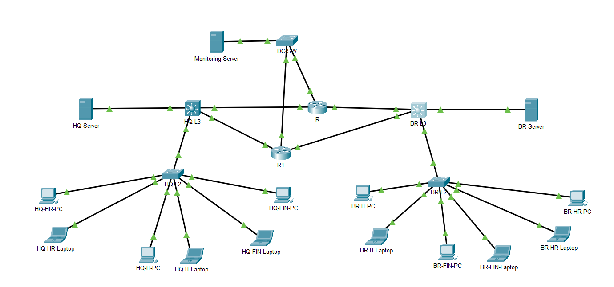
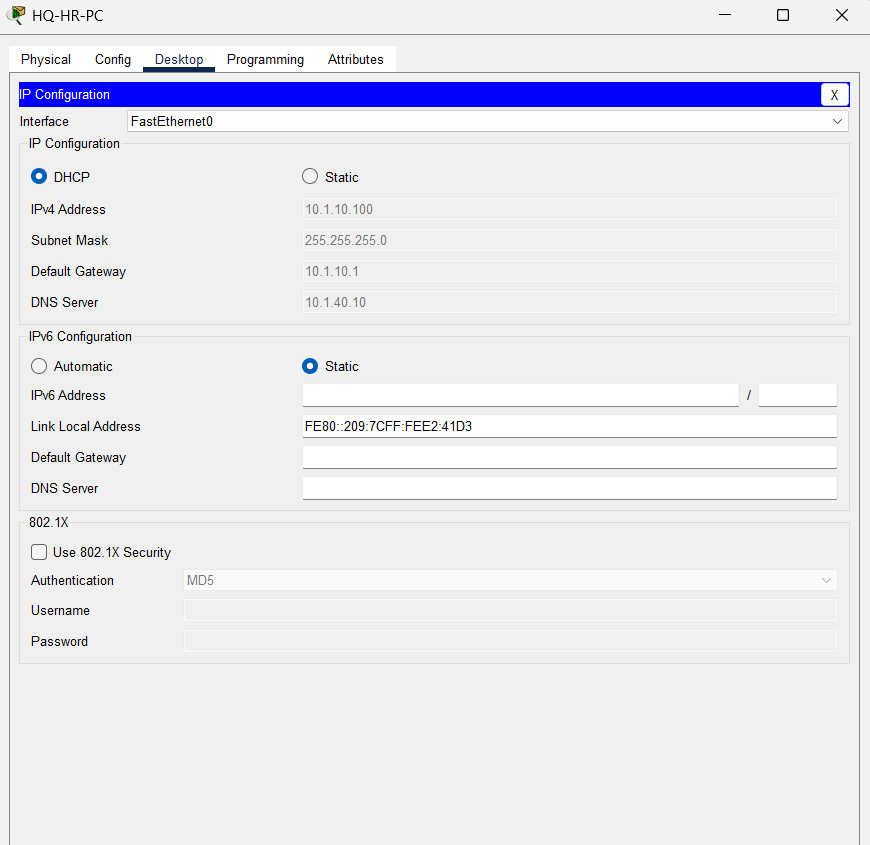
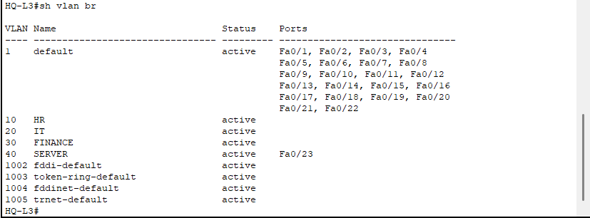
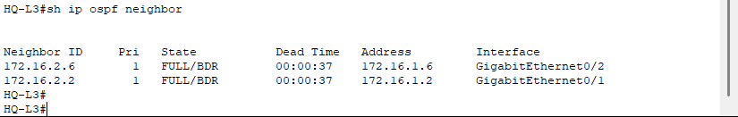
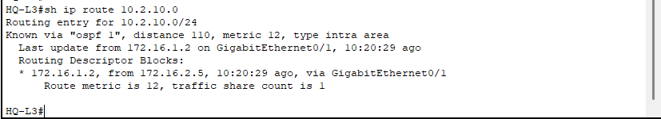
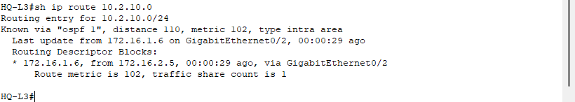
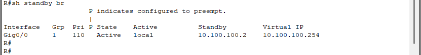
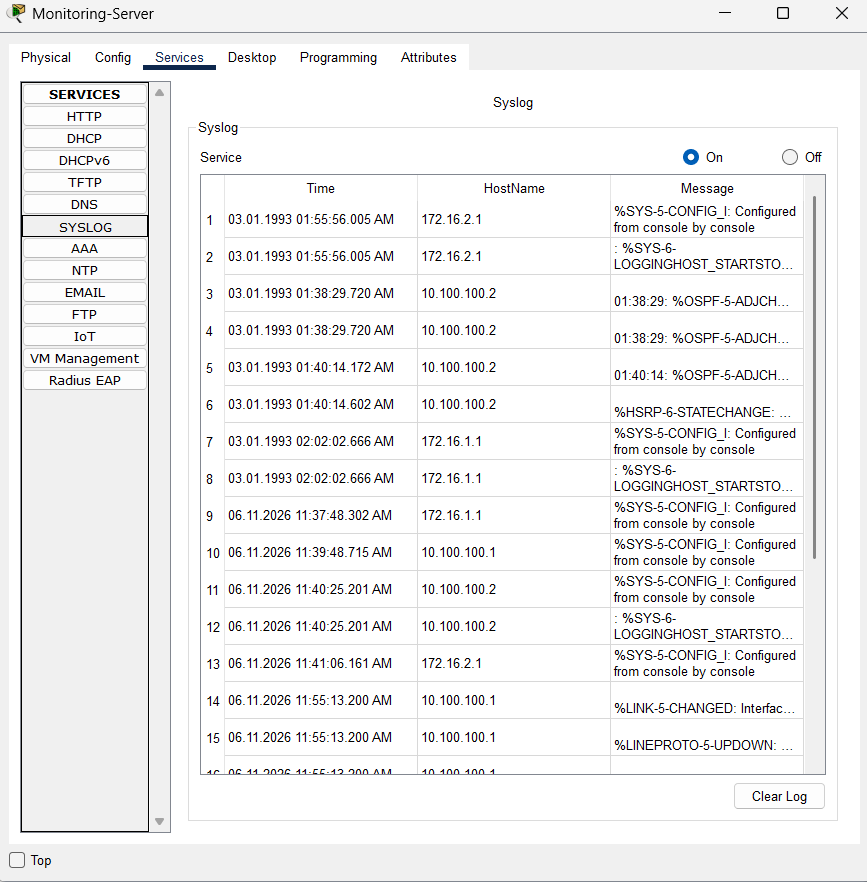
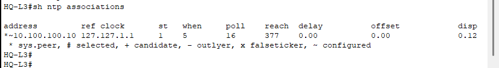
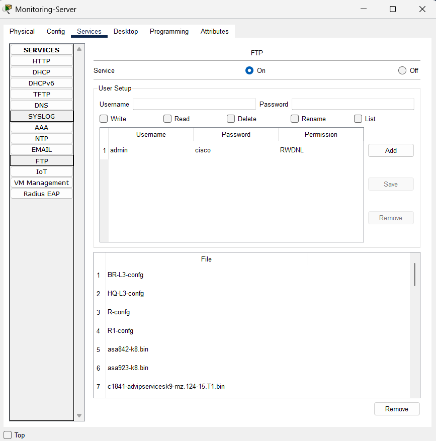

# 🌐 Enterprise WAN Infrastructure

<div align="center">


**A multi-site enterprise WAN simulation featuring dual-path OSPF routing, HSRP gateway redundancy, centralized Data Center monitoring, and automated configuration backups — built in Cisco Packet Tracer.**

</div>

---

## 📌 Project Overview

This project simulates a production-grade enterprise WAN connecting a **Headquarters (HQ)**, a **Branch Office (BR)**, and a centralized **Data Center Monitoring Platform**.

The network is engineered for high availability and operational visibility — featuring dynamic OSPF routing with cost-manipulated path preference, HSRP gateway redundancy, DHCP relay across routed boundaries, and a fully functional Data Center running Syslog, NTP, and FTP services.

> 💡 *Both WAN failover (OSPF reconvergence) and gateway failover (HSRP takeover) were simulated and verified — with all state changes captured by the centralized Syslog server in real time.*

---

## 🗺️ Network Topology

| Network Topology |  |

---
### OSPF Path Design

```
  PRIMARY PATH   → HQ-L3 ══════ R  ══════ BR-L3   (lower OSPF cost)
  BACKUP PATH    → HQ-L3 ──────R1 ────── BR-L3   (higher OSPF cost)
```

---

## 🔌 IP Addressing Plan

### Headquarters — VLAN Subnets

| VLAN | Department | Network |
|------|-----------|---------|
| 10 | HR | `10.1.10.0/24` |
| 20 | IT | `10.1.20.0/24` |
| 30 | Finance | `10.1.30.0/24` |
| 40 | Server | `10.1.40.0/24` |

### Branch Office — VLAN Subnets

| VLAN | Department | Network |
|------|-----------|---------|
| 10 | HR | `10.2.10.0/24` |
| 20 | IT | `10.2.20.0/24` |
| 30 | Finance | `10.2.30.0/24` |
| 40 | Server | `10.2.40.0/24` |

### WAN Links

| Link | Network |
|------|---------|
| HQ-L3 ↔ R (Primary) | `172.16.1.0/30` |
| HQ-L3 ↔ R1 (Backup) | `172.16.1.4/30` |
| BR-L3 ↔ R (Primary) | `172.16.2.0/30` |
| BR-L3 ↔ R1 (Backup) | `172.16.2.4/30` |

### Data Center

| Device | IP Address | Role |
|--------|-----------|------|
| R | `10.100.100.1` | HSRP Active |
| R1 | `10.100.100.2` | HSRP Standby |
| HSRP Virtual IP | `10.100.100.254` | Monitoring Server Gateway |
| Monitoring Server | `10.100.100.10` | Syslog · NTP · FTP |

---

## ⚙️ Technologies Implemented

### 1. 🔲 VLAN Segmentation
Four VLANs deployed identically at both HQ and Branch to isolate HR, IT, Finance, and Server traffic at each site.

### 2. 🔗 IEEE 802.1Q Trunking
Trunk links configured between L2 and L3 switches at each site, carrying all VLANs across shared uplinks.

### 3. 🔄 Inter-VLAN Routing via SVIs
Layer 3 switches at both HQ and BR handle local inter-VLAN routing through Switch Virtual Interfaces, keeping intra-site traffic off the WAN.

### 4. 🗺️ OSPF Area 0 — Dynamic Routing
OSPF runs across all Layer 3 devices in a single Area 0. Interface costs were manually tuned to ensure R is the preferred WAN path under normal conditions, with R1 serving as automatic failover.

| Path | Routers | Preference |
|------|---------|-----------|
| Primary | HQ-L3 → R → BR-L3 | Lower OSPF cost |
| Backup | HQ-L3 → R1 → BR-L3 | Higher OSPF cost |

### 5. 🛡️ HSRP — Gateway Redundancy
HSRP is deployed on the Data Center segment. The Monitoring Server points to the virtual IP `10.100.100.254` as its default gateway — automatically maintained by whichever router is currently active.

| Role | Router | IP |
|------|--------|----|
| Active | R | `10.100.100.1` |
| Standby | R1 | `10.100.100.2` |
| Virtual Gateway | — | `10.100.100.254` |

### 6. 📡 DHCP + DHCP Relay
Local DHCP servers assign addresses to department hosts at each site. IP Helper Addresses are configured on L3 switch SVIs to forward DHCP requests across VLAN boundaries.

### 7. 📊 Syslog — Centralized Event Logging
All network devices forward log messages to the Monitoring Server. Captured events include OSPF adjacency changes, interface state transitions, HSRP role changes, and general system events.

### 8. 🕐 NTP — Network Time Synchronization
The Monitoring Server acts as the NTP source for all devices — ensuring consistent timestamps across HQ-L3, BR-L3, R, and R1 for accurate log correlation.

### 9. 💾 FTP — Configuration Backup
Device running configurations are backed up to the FTP server on the Monitoring Server. Backed-up devices include HQ-L3, BR-L3, R, and R1.

---

## 🔁 Failover Validation

### WAN Failover — OSPF Reconvergence

| Step | Action | Result |
|------|--------|--------|
| 1 | Primary WAN link (HQ-L3 ↔ R) shut down | Link goes down |
| 2 | OSPF detects topology change | Adjacency dropped |
| 3 | OSPF reconverges via backup path | Traffic shifts to R1 |
| 4 | Syslog captures OSPF state change | Event logged with NTP timestamp |
| 5 | Primary link restored | OSPF reconverges back to primary |

### Gateway Failover — HSRP Takeover

| Step | Action | Result |
|------|--------|--------|
| 1 | Active router R simulated as failed | HSRP Hello timer expires |
| 2 | R1 transitions from Standby → Active | Virtual IP ownership transferred |
| 3 | Monitoring Server connectivity maintained | No manual reconfiguration needed |
| 4 | Syslog captures HSRP state change | Role transition logged |

---

## 🖼️ Verification Screenshots

| Test | Screenshot |
|------|-----------|
| DHCP Verification |  |
| Inter-VLAN Routing |  |
| OSPF Neighbors |  |
| Primary Path |  |
| WAN Failover |  |
| HSRP Validation |  |
| Syslog Events |  |
| NTP Sync |  |
| FTP Backup |  |

---

## 🔎 Key Verification Commands

```bash
# OSPF
show ip ospf neighbor                  # Verify neighbor adjacencies
show ip ospf interface brief           # Check OSPF cost per interface
show ip route ospf                     # Confirm OSPF-learned routes

# HSRP
show standby brief                     # Verify Active/Standby roles and VIP

# DHCP
show ip dhcp binding                   # View address assignments per pool

# Monitoring Services
show logging                           # Confirm Syslog messages and server
show ntp status                        # Verify NTP synchronization state
show ntp associations                  # Check NTP peer relationships
```

---

## 🧠 Skills Demonstrated

`Enterprise WAN Design` · `VLAN Implementation` · `Inter-VLAN Routing` · `OSPF Area 0` · `OSPF Cost Manipulation` · `WAN Redundancy` · `HSRP` · `DHCP Relay` · `Syslog Monitoring` · `NTP Synchronization` · `FTP Configuration Backup` · `Multi-site Network Design` · `Cisco IOS CLI` · `Network Troubleshooting`


<div align="center">

*Designed and implemented as a practical demonstration of enterprise WAN infrastructure principles including dynamic routing, high availability, and centralized network monitoring.*

</div>
